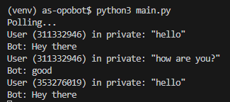

# 🤖 Repositorio de un bot de Telegram para las oposiciones

## 🛠️ Configuración del entorno

```bash
python -m venv venv
```

### 💻 Si estás en Linux/macOS:
```bash
source venv/bin/activate
```

### 🖥️ Si estás en Windows:
```bash
.\venv\Scripts\activate
```

## 📦 Instalación de dependencias

### 🚀 Instala Poetry:
```bash
pip install poetry
```

### 📥 Instala las dependencias del proyecto:
```bash
poetry install
```

### 📥 Añadir dependencia a poetry:
```bash
poetry add <paquete>
```

## 🔑 Variables de entorno

Crea un fichero con las variables de entorno:
```bash
touch .env
```

Incluye dentro las siguientes variables:
```env
API_KEY=""
```

## 🐳 Inicializa la base de datos

```bash
docker build -t opobot-db .
```

```bash
docker run -d \
  --name opobot-db \
  -e MONGO_INITDB_ROOT_USERNAME=root \
  -e MONGO_INITDB_ROOT_PASSWORD=root_password \
  -e MONGO_INITDB_DATABASE=opobot \
  -p 27017:27017 \
  opobot-db
```

Para más información sobre la base de datos, consulta el [README de la base de datos](docs/db-commands.md).


## 🚀 Ejecución de la API
```bash
python3 api/main.py
```


## ▶️ Ejecución del bot

```bash
python3 main.py
```

Una vez ejecutemos este script, el bot se quedará escuchando:


